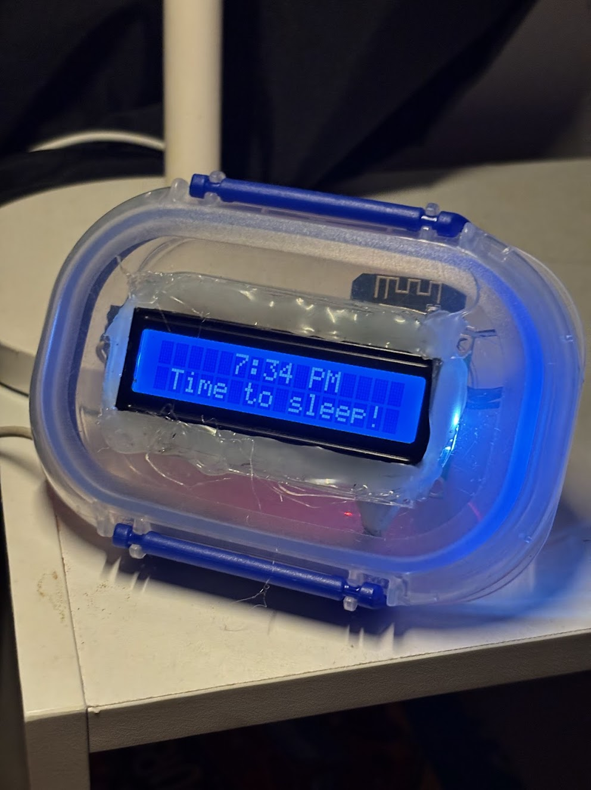

# Hardware

Kid Clock is built around a **Wemos D1 Mini** (ESP8266), a **16×2 LCD with PCF8574 I2C backpack**, and two indicator LEDs.



## Bill of materials

| Item | Qty | Notes |
|------|-----|-------|
| Wemos D1 Mini (ESP8266) | 1 | `board: d1_mini` in ESPHome |
| 16×2 LCD with PCF8574 I2C backpack | 1 | Common addresses: `0x27` or `0x3F` (default config uses `0x3F`) |
| Green LED | 1 | Wake indicator |
| Red LED | 1 | Sleep indicator |
| Resistors (~220–330 Ω) | 2 | One per LED |
| 5 V USB power supply | 1 | Phone charger or micro-USB cable |
| Jumper wires | — | Breadboard or perfboard assembly |
| Enclosure (optional) | — | Not included in this repo |

## Pin map (D1 Mini)

| Function | ESP GPIO | D1 label |
|----------|----------|----------|
| I2C SDA | GPIO4 | D2 |
| I2C SCL | GPIO5 | D1 |
| Wake LED (green) | GPIO12 | D6 |
| Sleep LED (red) | GPIO13 | D7 |

## Wiring

```
D1 Mini          PCF8574 LCD backpack
  D2 (GPIO4) ─── SDA
  D1 (GPIO5) ─── SCL
  3V3        ─── VCC
  GND        ─── GND

D6 (GPIO12) ───[220Ω]──► Green LED (anode) ──► cathode ──► GND
D7 (GPIO13) ───[220Ω]──► Red LED (anode)    ──► cathode ──► GND
```

### LCD I2C address

Most backpacks ship with address `0x27` or `0x3F`. The default config uses `0x3F`. If the display stays blank, try changing `address` in `kid-clock.yaml` or temporarily set `i2c: scan: true` to discover the address in the serial log.

## Assembly

1. Mount the D1 Mini on a breadboard or perfboard.
2. Connect the LCD backpack: SDA → D2, SCL → D1, VCC → 3V3, GND → GND.
3. Wire each LED with a current-limiting resistor between the GPIO pin and GND (active-high).
4. Power via USB. Flash firmware before final enclosure assembly if access to the USB port is tight.

## Customization via substitutions

Edit the `substitutions:` block at the top of `kid-clock.yaml`:

| Substitution | Default | Purpose |
|--------------|---------|---------|
| `timezone` | `Pacific/Auckland` | SNTP / local time |
| `green_led_pin` | `GPIO12` | Wake LED |
| `red_led_pin` | `GPIO13` | Sleep LED |
| `default_child_name` | `Sam` | Greeting name |
| `default_greeting_prefix` | `Kia ora ` | Text before name |
| `default_alternate_seconds` | `5` | Greeting/message alternation interval |

Default rules (wake 07:00–08:00, sleep 19:30–20:30) are also set via substitutions and can be changed before first flash or via the web UI afterward.
